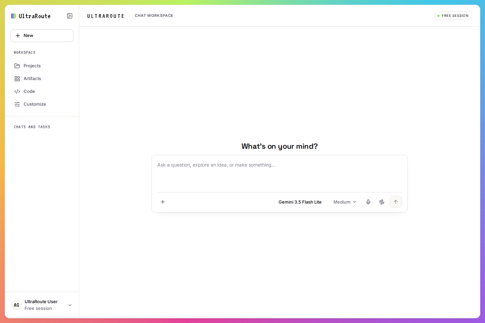

# UltraRoute

UltraRoute connects a chat interface to ChatGPT, Claude, and Gemini through their web sessions. It also supports Gemini through the Google API. The server translates chat requests and provider responses while keeping credentials on the server.

## Chat workspace

The workspace uses the Prismfield design system: a quiet white canvas, a colorful frame, geometric headings, and lime actions. It includes a model picker with provider tabs, a per model reasoning control, inline Gemini source citations, and a responsive chat transcript.

The composer **+** menu keeps “More uploads” and “More tools” in the main list. Their expanded options remain side flyouts on desktop and expand inline inside the mobile drawer.

On screens narrower than 860px, the model picker and **+** menu slide in from below the viewport without focus-induced jumps. Pull the handle down to dismiss; a short pull snaps back. Tap the handle or the dimmed area, or press Escape, to close. Drawer content scrolls independently, and keyboard focus stays inside the open drawer.

The mobile header shows only the sidebar button. Navigation fills the screen: open it with the button or swipe right from the left edge, then close with the collapse button or Escape. Desktop navigation and anchored menus are unchanged. Drawer and navigation transitions respect reduced-motion preferences.

<!-- README_SCREENSHOT_START -->

<!-- README_SCREENSHOT_END -->

To regenerate the image locally, start the server, then run `npm run screenshot:readme`. The `Update README screenshot` GitHub Actions workflow does the same on each push to `master` and commits changes to the image and README.

## Run locally

Requirements: Node.js 22 or newer and npm.

```bash
npm run build:client
npm run server
```

Open [http://localhost:3000](http://localhost:3000).

The server loads `.env.local` and `.env` when present. Keep both files private. Set `GEMINI_COOKIE_FILE` to the file AuthoCookie updates. The server reads it for model discovery and chat, then uses the refreshed cookie values. If it is unset, UltraRoute reads Gemini cookies from the local Chromium profile. Set `GEMINI_CHROMIUM_PATH` if Chromium is installed elsewhere.

The server saves each account's Claude and Gemini model lists. It loads saved lists at startup and refreshes them every six hours. Set `MODEL_CATALOG_CACHE_FILE` to change the file location or `MODEL_CATALOG_REFRESH_INTERVAL_MS` to change the interval. Snapshot files are private and do not contain credentials. If an update fails, the server keeps the last successful list.

For ChatGPT, set `CHATGPT_STORAGE_STATE_FILE` or `CHATGPT_COOKIE_HEADER`. You can also set `CHATGPT_BROWSER_PROFILE` to use a dedicated Chromium profile. For Claude, set `CLAUDE_SESSION_KEY` or use an existing local Chromium session.

The following commands check the client, types, and unit tests:

```bash
npm run build:client
npm run typecheck
npm test
```

The unit tests use local fixtures. They do not need provider credentials or make live requests.

## Providers

### ChatGPT Web

ChatGPT requests use a temporary chat. UltraRoute uses the regular composer and upload controls, then reads the conversation response. It does not automate login, multi factor authentication, CAPTCHA, or other security checks. If verification is required, complete it in the signed in browser. Protect a dedicated browser profile like a password, and do not share it between accounts.

A ChatGPT turn is buffered before UltraRoute returns it, so tokens do not stream incrementally. The adapter checks that the assistant response finished successfully before returning it.

### Claude Web

Claude model discovery uses the signed in account's catalog. Locked models remain visible but cannot be selected. Reasoning levels come from the model catalog. Claude conversations keep continuation state scoped to the account, organization, model, and transcript.

### Gemini Web

Gemini model discovery uses the signed in account's model picker. It keeps Google's model IDs. The reasoning slider maps Low and High to normal and extended thinking. Grounded answers keep their source links and citation ranges. Hover a citation to highlight the text it supports.

Gemini Web returns completed answers through the StreamGenerate protocol. Continued chats are buffered before UltraRoute returns them. Gemini's bootstrap can provide either `SNlM0e` or `thykhd`; UltraRoute also sends `FdrFJe` when present.

### Gemini API

Set `GOOGLE_GENERATIVE_AI_API_KEY` to use Gemini through the Google API. This route is separate from Gemini Web and uses the official Google SDK.

## Security and limitations

- Keep cookies, session keys, API keys, browser state files, and browser profiles private. Never commit real credentials.
- Attachments are checked for count, size, media type, and image dimensions. Remote downloads reject private and local network addresses and redirects.
- UltraRoute does not solve CAPTCHA, Cloudflare Turnstile, or login challenges. Resolve them in the signed in provider session.
- Provider web interfaces can change without notice. If a request reports `UPSTREAM_DRIFT`, inspect the relevant provider decoder and current response format.

## Integration tests

The local Chromium tests use fabricated protocol data and block external requests. Install Playwright Chromium if it is not already available, then run:

```bash
RUN_BROWSER_TESTS=1 npm run test:integration
```

Tests using actual provider sessions are opt in. The normal integration command does not enable them. Live tests require `RUN_LIVE_TESTS=1`; tests that use a ChatGPT browser profile also require `RUN_PROFILE_TESTS=1`.

## Project layout

- `src/client/` contains the React workspace, model picker, styles, and citation rendering.
- `src/providers/` contains provider discovery, request handling, and response decoders.
- `src/shared/` contains shared request types, validation, errors, and continuation state.

The model cache is scoped by a SHA-256 hash of provider account material. Snapshot files have owner-only permissions and are replaced atomically. Model status responses include `catalogStatus` with a fetch time, stale flag, and optional safe refresh error. There is no force-refresh endpoint. The server currently listens on all interfaces without administrator authentication, so adding an unauthenticated refresh route would expose upstream credentials.
