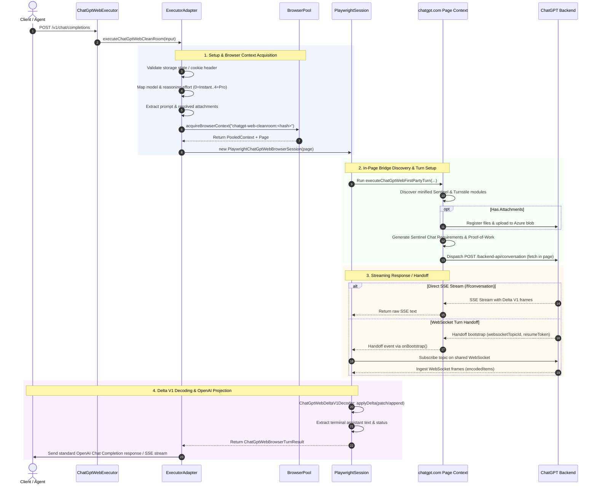

# ChatGPT Web Provider Architecture

## 1. Executive Summary & Purpose

The **ChatGPT Web** provider (`chatgpt-web`, aliases `cgpt-web`, alongside its specialized sibling `chatgpt-web-codex`) enables OmniRoute clients to route OpenAI Chat Completions requests through an authenticated, first-party `chatgpt.com` browser session.

Instead of calling public developer API endpoints, `chatgpt-web` leverages a **clean-room first-party browser bridge**. The architecture does not scrape UI HTML or emulate fake mouse clicks in the DOM; rather, it attaches to an authenticated Playwright page context running `https://chatgpt.com/?temporary-chat=true`. From within this page context, it interacts with ChatGPT's first-party ECMAScript modules to generate anti-bot tokens (Sentinel, Turnstile, and Proof-of-Work), registers and uploads image/file attachments to Azure blob storage, dispatches conversation turns, handles conversation WebSocket handoffs, and decodes ChatGPT's internal `delta_encoding: "v1"` stream into standard OpenAI Chat Completion chunks (`role`, `content`, `stop`).

```
┌────────────────────────────────────────────────────────┐
│ Client (REST Client, SDK, Agent /v1/chat/completions)   │
└───────────────────────────┬────────────────────────────┘
                            │ OpenAI Request Payload
                            ▼
┌────────────────────────────────────────────────────────┐
│                   OmniRoute Gateway                    │
└───────────────────────────┬────────────────────────────┘
                            │
                            ▼
┌────────────────────────────────────────────────────────┐
│                 ChatGptWebExecutor                     │
│           (open-sse/executors/chatgpt-web.ts)          │
└───────────────────────────┬────────────────────────────┘
                            │ executeChatGptWebCleanRoom()
                            ▼
┌────────────────────────────────────────────────────────┐
│             Clean-Room Adapter Subsystem               │
│     (open-sse/utils/chatgptWebExecutorAdapter.ts)      │
│  • Storage-state & cookie normalization                │
│  • Prompt & attachment preparation                     │
│  • UI model & reasoning selection                      │
└───────────────────────────┬────────────────────────────┘
                            │
              ┌─────────────┴─────────────┐
              ▼                           ▼
 ┌─────────────────────────┐ ┌─────────────────────────┐
 │   Browser Pool Context  │ │  Turn Runner & Session  │
 │ (services/browserPool)  │ │ (chatgptWebBrowser-     │
 │ • Headed/Headed-in-Xvfb │ │  Session.ts)            │
 │ • chatgpt.com cookie/   │ │ • Turn timeout (180s)   │
 │   storageState injected │ │ • WebSocket multiplexer │
 └────────────┬────────────┘ └────────────┬────────────┘
              │                           │
              └─────────────┬─────────────┘
                            │
                            ▼
 ┌─────────────────────────────────────────────────────┐
 │       First-Party Page Bridge (chatgptWebFirstParty) │
 │ • In-page Sentinel token generation                 │
 │ • Proof-of-work & Turnstile execution               │
 │ • Attachment registration & Azure blob upload       │
 │ • Draft storage & /backend-api/conversation dispatch│
 └──────────────────────────┬──────────────────────────┘
                            │
              ┌─────────────┴─────────────┐
              ▼                           ▼
 ┌─────────────────────────┐ ┌─────────────────────────┐
 │ Direct SSE Completion   │ │ WebSocket Stream        │
 │ (/f/conversation SSE)   │ │ (chatgptWebTransport)   │
 └────────────┬────────────┘ └────────────┬────────────┘
              │                           │
              └─────────────┬─────────────┘
                            │
                            ▼
 ┌─────────────────────────────────────────────────────┐
 │         Delta V1 JSON Decoder (chatgptWebDeltaV1)   │
 │ • Parses patch/add/append/replace JSON operations   │
 │ • Reconstructs assistant message document           │
 │ • Extracts finished text & turn status              │
 └──────────────────────────┬──────────────────────────┘
                            │
                            ▼
   Client: Standard OpenAI Chunk Stream (`data: [DONE]`)
```

---

## 2. Component Taxonomy & Codebase Layout

The implementation is structured under `open-sse/executors/`, `open-sse/utils/`, and `src/lib/providers/`:

| Module Path | Architectural Role | Key Functions / Classes |
| :--- | :--- | :--- |
| `open-sse/executors/chatgpt-web.ts` | **Executor Entrypoint**: Extends `BaseExecutor`. Maps high-level execution inputs, error statuses (401 credentials, 429 quota exhaustion, 400 validation, 502 failure), and sanitizes messages. | `ChatGptWebExecutor`, `statusForAdapterError` |
| `open-sse/utils/chatgptWebExecutorAdapter.ts` | **Adapter & Request Normalizer**: Prepares prompts, attachments, model selection, reasoning effort indices (0=Instant to 4=Pro), Chrome path discovery, and converts final turn text to OpenAI completion/SSE responses. | `executeChatGptWebCleanRoom`, `prepareChatGptWebBrowserRequest`, `normalizeChatGptWebStorageState`, `chatGptWebStorageStateFromCookieHeader`, `buildChatGptWebOpenAiResponse` |
| `open-sse/utils/chatgptWebBrowserSession.ts` | **Turn Orchestrator**: Coordinates browser page lifecycle (`PlaywrightChatGptWebBrowserSession`), runs the 180s turn runner (`ChatGptWebBrowserTurnRunner`), and orchestrates bootstrap vs. WebSocket frame ingestion. | `PlaywrightChatGptWebBrowserSession`, `ChatGptWebBrowserTurnRunner`, `parseChatGptWebDirectConversation` |
| `open-sse/utils/chatgptWebFirstParty.ts` | **In-Page Bridge**: Evaluates inside the live `chatgpt.com` Chromium page. Dynamically extracts ChatGPT's minified first-party modules (Sentinel requirements, Proof-of-Work manager, Turnstile manager), uploads attachments to blob storage, and submits conversation requests. | `executeChatGptWebFirstPartyTurn`, `parseChatGptWebFirstPartyModuleContract`, `uploadRegisteredAttachments` |
| `open-sse/utils/chatgptWebTransport.ts` | **WebSocket & Topic Ingestor**: Parses conversation handoff SSE payloads, builds subscription frames, and multiplexes topic frames over the shared ChatGPT WebSocket. | `ChatGptWebTopicStream`, `parseChatGptWebConversationHandoff`, `buildChatGptWebSubscribeCommand` |
| `open-sse/utils/chatgptWebDeltaV1.ts` | **Delta V1 Decoder**: Stateful parser that interprets ChatGPT's `delta_encoding: "v1"` stream. Replays JSON pointer operations (`add`, `append`, `patch`, `replace`) onto a live document tree. | `ChatGptWebDeltaV1Decoder`, `parseChatGptWebEncodedItem` |
| `open-sse/services/browserPool.ts` | **Browser Context Pool**: Manages persistent Playwright browser instances and contexts with proxy routing, fingerprinting, storage states, and auto-eviction. | `acquireBrowserContext`, `openPage`, `BrowserPoolContextOptions` |
| `src/lib/providers/validation/chatgptWeb.ts` | **Credential Validator**: Validates that storage-state JSON or raw Cookie headers belong to first-party origins (`chatgpt.com`, `openai.com`) and contain valid session tokens. | `validateChatGptWebProvider` |

---

## 3. End-to-End Execution Flow



---

## 4. Deep-Dive Subsystem Architecture

### 4.1. Credentials & Storage State Validation

ChatGPT requires a rich browser context (`cookies` + `localStorage`). The provider accepts credentials in two formats:
1. **Raw Cookie Header**: e.g., `Cookie: __Secure-next-auth.session-token=...; __cf_bm=...`. The adapter automatically normalizes this into a valid Playwright `storageState` targeting the `.chatgpt.com` domain with `secure: true` and `sameSite: "Lax"`.
2. **Playwright `storageState` JSON**: Contains full cookies and origins.

#### Domain Security Enclosure
To prevent credential theft or SSRF attacks, `normalizeChatGptWebStorageState()` enforces strict origin whitelisting:
- Permitted cookie domains: `chatgpt.com`, `openai.com` (and subdomains).
- Permitted origins: `https://chatgpt.com`, `https://openai.com`.
- Any foreign domain or origin immediately fails validation (`"ChatGPT Web browser storage state contains a foreign cookie domain"`).

### 4.2. Model & Reasoning Effort Mapping

The model registry exposes both Free (Luna) and Plus/Pro (Sol/GPT-5.5) model routes:

| Model ID | Display Name | UI Selection Mode | Reasoning Effort Index |
| :--- | :--- | :--- | :--- |
| `gpt-5.6-luna-free` | GPT-5.6 Luna — Free | `kind: "free"` | `thinkEnabled: false` |
| `gpt-5.6-luna-free-thinking` | GPT-5.6 Luna — Free Thinking | `kind: "free"` | `thinkEnabled: true` |
| `gpt-5-6-instant` / `gpt-5-6` | GPT-5.6 Sol — Instant | `kind: "picker"`, Label: "GPT-5.6 Sol" | `effortIndex: 0` |
| `gpt-5-6-thinking` / `gpt-5-6-sol` | GPT-5.6 Sol — Thinking | `kind: "picker"`, Label: "GPT-5.6 Sol" | `effortIndex: 1` (Med), `2` (High), `3` (Max) |
| `gpt-5-6-pro` | GPT-5.6 Sol — Pro | `kind: "picker"`, Label: "GPT-5.6 Sol" | `effortIndex: 4` |
| `gpt-5-5-instant` | GPT-5.5 — Instant | `kind: "picker"`, Label: "GPT-5.5" | `effortIndex: 0` |
| `gpt-5-5-thinking` / `gpt-5-5` | GPT-5.5 — Thinking | `kind: "picker"`, Label: "GPT-5.5" | `effortIndex: 1`..`3` |
| `gpt-5-5-pro` | GPT-5.5 — Pro | `kind: "picker"`, Label: "GPT-5.5" | `effortIndex: 4` |

The `effortIndex` corresponds directly to ChatGPT's UI picker slider indices.

### 4.3. In-Page First-Party Bridge (`chatgptWebFirstParty.ts`)

Instead of attempting to recreate OpenAI's dynamic Sentinel cryptography in Node.js, OmniRoute uses a **reflective bridge** that executes directly inside the loaded ChatGPT browser tab:

1. **Dynamic Contract Discovery**:
   - `parseChatGptWebFirstPartyModuleContract(source)` scans loaded script bundles for semantic AST regex patterns.
   - Locates minified function exports for:
     - `finalizeRequirements`
     - `proofManager` (Proof-of-Work solver)
     - `turnstileManager` (Cloudflare Turnstile token fetcher)
     - `requestClient` (first-party API client)
     - `buildSentinelHeaders`
2. **Sentinel Chat Requirements & Anti-Bot Resolution**:
   - Executes inside the page context:
     ```javascript
     const token = await proofManager.getEnforcementToken(requirements, { forceSync: true });
     const headers = buildSentinelHeaders(requirements, token, ...);
     ```
   - All anti-bot tokens are generated by OpenAI's own client code with legitimate browser execution invariants.
3. **Attachment Pipeline**:
   - If the request contains images or document files, the bridge calls ChatGPT's attachment registration endpoint `/backend-api/files`.
   - The file bytes are PUT directly to Azure Blob storage with `x-ms-blob-type: BlockBlob`.
   - The returned `file_id` is linked into the conversation payload draft.
4. **Request Submission**:
   - Dispatches the POST `/backend-api/conversation` request via native browser `fetch()`.

### 4.4. WebSocket Handoff & Delta V1 Stream Decoding

ChatGPT uses two response transmission channels:
- **Direct Stream**: HTTP SSE stream from `/f/conversation`.
- **WebSocket Handoff**: A short SSE bootstrap payload returning a `websocketTopicId` and `turnExchangeId`. The conversation stream is then multiplexed over a shared WebSocket connection (`wss://chatgpt.com/backend-api/lat/r/...`).

#### The Delta V1 JSON Decoder (`chatgptWebDeltaV1.ts`)
Stream frames are delivered as JSON patches with RFC 6901 JSON pointers under the `v1` encoding:
- `p`: JSON pointer path (e.g. `/message/content/parts/0`).
- `o`: Operation (`add`, `append`, `patch`, `replace`).
- `v`: Delta string or structure.

The `ChatGptWebDeltaV1Decoder` maintains a mutable in-memory message object. As `append` and `patch` frames arrive:
1. It updates string fragments in `/message/content/parts`.
2. Inspects `/message/status` (`in_progress` $\rightarrow$ `finished_successfully`).
3. When `end_turn: true` and `status: "finished_successfully"` are observed, it extracts the complete assistant text.

### 4.5. Headed vs. Headless Browser Execution

ChatGPT employs aggressive bot detection that detects headless Chrome configurations.
- **Displayless Linux / Docker**: Runs headed Chrome inside an **Xvfb virtual display** (provided via the `omniroute-web` Docker profile or system Xvfb).
- **Headed Context**: `browserPool.ts` acquires a headed Chrome context (`headless: false`) and points to a system Chrome binary (`resolveChatGptWebChromeExecutable()`).
- **Temporary Chat Isolation**: The browser session navigates to `https://chatgpt.com/?temporary-chat=true`. This ensures requests are neither saved to user chat history nor pollute account memories.

---

## 5. Error Handling & Account Fallback

`statusForAdapterError()` translates browser-level and upstream ChatGPT failures into standard HTTP status codes:

- **401 Unauthorized**: Missing or expired session tokens (`__Secure-next-auth.session-token`).
- **429 Too Many Requests**: Triggered when upstream signals quota limits (e.g., `image limit exceeded`, `usage limit reached`, `status 429`). This allows OmniRoute's **Account Fallback** and **Combo Engine** to detect free account exhaustion and fail over to the next configured account or model.
- **400 Bad Request**: Unsupported tools, malformed prompts, or invalid model requests.
- **502 Bad Gateway**: Browser connection crash, navigation timeout, or incomplete Delta V1 stream.

---

## 6. Verification & Quality Gates

The implementation is validated by a clean-room suite under `tests/unit/`:

- `tests/unit/chatgpt-web-cleanroom-provider.test.ts`: Executor registration, BaseExecutor inheritance, credential validation.
- `tests/unit/chatgpt-web-executor-adapter-cleanroom.test.ts`: Request preparation, reasoning effort mapping, storage state validation.
- `tests/unit/chatgpt-web-browser-session-cleanroom.test.ts`: Playwright session turn runner, direct conversation parsing, timeout handling.
- `tests/unit/chatgpt-web-first-party-cleanroom.test.ts`: First-party module contract parser and AST semantic matching.
- `tests/unit/chatgpt-web-delta-v1-cleanroom.test.ts`: Delta V1 protocol decoding (append, patch, replace, JSON pointers).
- `tests/unit/chatgpt-web-handshake-handoff-cleanroom.test.ts`: WebSocket conversation handoff and frame multiplexing.

Run the test suite:
```bash
node --import tsx/esm --test tests/unit/chatgpt-web-*.test.ts
```
*(Meets the repository coverage gate of $\ge 60\%$ across statements, branches, functions, and lines).*
