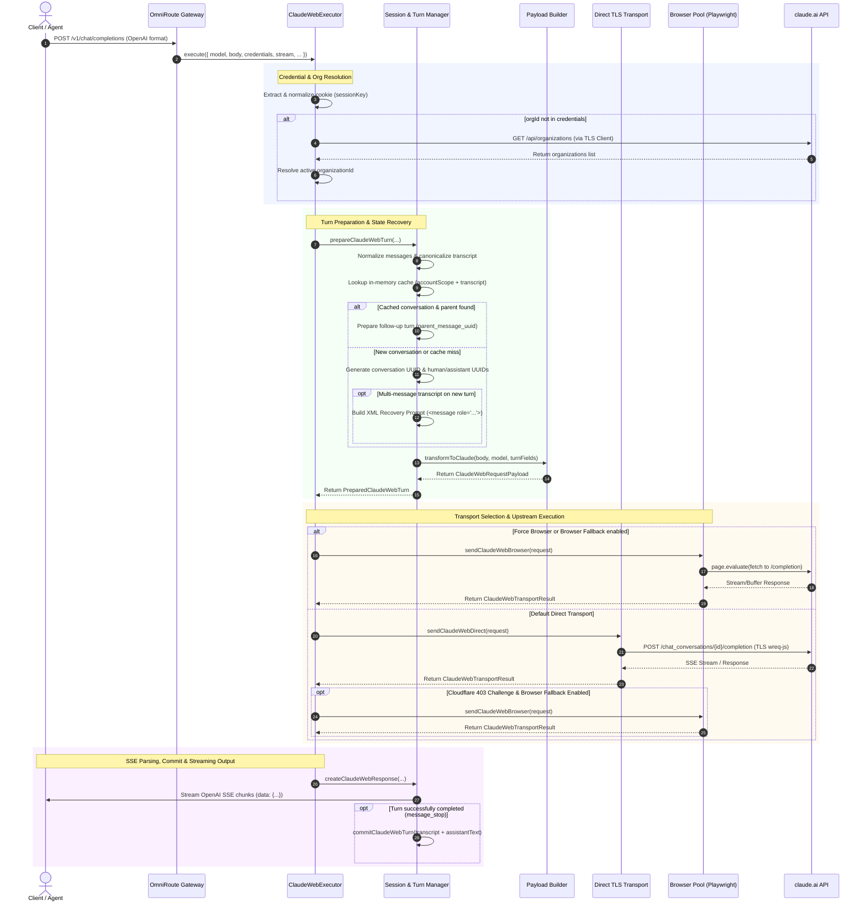

# Claude Web Code Provider Architecture

## 1. Executive Summary & Purpose

The **Claude Web** provider (`claude-web`, alias `cw` or `cw-web`) in OmniRoute enables clients—ranging from standard OpenAI-compatible API clients to coding agent harnesses and CLI tools (such as Claude Code CLI via `@anthropic-ai/claude-code`, Cursor, and Codex)—to route requests through an authenticated `claude.ai` web session.

Unlike standard API-key providers that talk to `https://api.anthropic.com/v1/messages`, `claude-web` interfaces directly with Anthropic's browser-facing web application endpoints (`https://claude.ai/api/*`). It translates OpenAI-compatible Chat Completion payloads into Claude Web's internal conversation and turn structure, handles strict Cloudflare Turnstile anti-bot bypass via TLS fingerprint impersonation and headless browser fallback, manages multi-turn conversation caching, and translates upstream Server-Sent Events (SSE) back into standard OpenAI SSE chunks with tool calling and reasoning support (`reasoning_content`).

```
┌────────────────────────────────────────────────────────┐
│ Client (Claude Code CLI / Cursor / IDE / /v1/chat/...)  │
└───────────────────────────┬────────────────────────────┘
                            │ OpenAI Chat Completion Request
                            ▼
┌────────────────────────────────────────────────────────┐
│                   OmniRoute Gateway                    │
│   (Open-SSE Dispatcher / Routing Engine / Executor)    │
└───────────────────────────┬────────────────────────────┘
                            │
              ┌─────────────┴─────────────┐
              ▼                           ▼
 ┌─────────────────────────┐ ┌─────────────────────────┐
 │   ClaudeWebExecutor     │ │  Credential Validation  │
 │  (open-sse/executors/   │ │ (webProvidersB.ts via   │
 │      claude-web.ts)     │ │   GET /organizations)   │
 └────────────┬────────────┘ └─────────────────────────┘
              │
              ├─► 1. Credential & Org Resolution (`sessionKey`, `orgId`)
              ├─► 2. Turn & Session Tracking (`session.ts`: cache & UUIDs)
              ├─► 3. Payload & Thinking Transform (`payload.ts`: tools/effort)
              ├─► 4. Transport Selection (`transport.ts` vs `browserTransport.ts`)
              │       ├─ Direct: Chrome 146 TLS Impersonation (`wreq-js`)
              │       └─ Browser: Headless Chromium via Playwright Context
              └─► 5. SSE Protocol Parser & Projection (`stream.ts`)
                            │
                            ▼
           Upstream `claude.ai/api/*` Endpoints
```

---

## 2. System Architecture & Components

The Claude Web provider implementation is modularized across several subsystems under `open-sse/executors/claude-web/`, `open-sse/services/`, and `src/lib/providers/`:

| Module Path | Core Responsibilities |
| :--- | :--- |
| `open-sse/executors/claude-web.ts` | **Host Orchestrator**: Extends `BaseExecutor`. Manages input validation, organization discovery, transport dispatching, error mapping, and audit sanitization. |
| `open-sse/executors/claude-web/session.ts` | **Turn & Session Manager**: Manages multi-turn conversation state, SHA-256 account-scoped caching, parent-message tracking, UUID generation, recovery prompt fallback, and `claude_web` extension parsing. |
| `open-sse/executors/claude-web/payload.ts` | **Payload Transformer**: Converts incoming OpenAI Chat Completion format into Claude Web wire JSON. Maps reasoning effort (`low`, `medium`, `high`, `xhigh`, `max`) into `effort` and `thinking_mode`, and transforms OpenAI function schemas into Claude Web tools. |
| `open-sse/executors/claude-web/transport.ts` | **Direct Transport Adapter**: Executes requests using `tlsFetchClaude()` over native TLS-impersonating HTTP client (`wreq-js`), preserving browser-aligned headers and handling Cloudflare 403 / 429 detections. |
| `open-sse/executors/claude-web/browserTransport.ts` | **Browser Context Adapter**: Account-scoped Playwright browser fallback. Captures UI templates (tools, tool states, personalized styles), executes page-level fetch, enforces request streaming within 16 MiB limit, and manages template caching. |
| `open-sse/executors/claude-web/stream.ts` | **SSE Protocol Parser & Response Builder**: Decodes upstream SSE text streams, parses Claude's internal event protocol (`message_start`, `content_block_start`, `content_block_delta`, `content_block_stop`, `message_delta`, `message_stop`), projects tool calls and thinking text, and synthesizes finish reasons on tool-idle timeouts. |
| `open-sse/services/claudeTlsClient.ts` | **TLS Client Module**: Factory instance of `createTlsClientModule` configured with `chrome_146` TLS/JA3 profile on Linux, backing `tlsFetchClaude()`. |
| `open-sse/config/claudeWebFingerprint.ts` | **Single Source of Truth Fingerprint**: Unifies `User-Agent`, `Sec-Ch-Ua`, and `Sec-Ch-Ua-Platform` across the direct executor, Playwright pool, and Turnstile solver to prevent Cloudflare clearance mismatches (#7548). |
| `src/lib/providers/validation/webProvidersB.ts` | **Credential Validator**: Validates cookie headers by probing `GET https://claude.ai/api/organizations` using the TLS client. |

---

## 3. Detailed Data Flow & Execution Lifecycle



---

## 4. Subsystem Deep-Dive

### 4.1. Authentication & Organization Discovery

Claude Web authenticates using session cookies captured from an active `claude.ai` browser session.

1. **Cookie Normalization**:
   - `readClaudeWebCookie` extracts credentials from either `cookie` or `apiKey`.
   - `normalizeClaudeSessionCookie` ensures bare strings (e.g. `sk-ant-sid01-...`) are formatted as standard cookie headers: `sessionKey=sk-ant-sid01-...`. Any additional cookies (e.g., `cf_clearance`, `intercom-device-id`) are retained.
2. **Organization Resolution (`getOrganizationId`)**:
   - The Claude Web API organizes all conversations under an organization UUID: `/api/organizations/{orgId}/chat_conversations/...`.
   - If the provider connection config specifies an `orgId`, it is used immediately.
   - Otherwise, `getOrganizationId()` initiates `GET https://claude.ai/api/organizations` via `tlsFetchClaude()`.
   - Returns the primary organization ID. If authentication fails (401), or a Cloudflare Turnstile block occurs (403), the failure reason (`authentication` or `challenge`) is flagged cleanly and mapped to HTTP 401 or HTTP 403.

### 4.2. Session Management & Continuation Cache (`session.ts`)

Claude Web is stateful upstream: each conversation is an immutable tree of messages referenced by UUIDs. Standard OpenAI `/v1/chat/completions` calls, however, are stateless and pass the complete message array on every turn.

`session.ts` bridges this gap using an in-memory transcript cache:
- **Cache Key Generation**:
  - `accountScope = sha256(credentialScope + " " + orgId + " " + model)`
  - `cacheKey = sha256(accountScope + " " + canonicalizeTranscript(messages))`
  - The transcript canonicalizer serializes every message as `${role.length}:${role}\x1e${content.length}:${content}\x1f` to guarantee deterministic, collision-resistant hashing.
- **Cache Lookup & State Linking**:
  - When a request arrives with $N$ messages, the system slices $0..N-1$ messages and checks `conversationCache`.
  - **Hit**: The previous `conversationId` and `assistantMessageUuid` are extracted. The new request is configured as a follow-up turn with `parent_message_uuid = cached.assistantMessageUuid`.
  - **Miss (New Conversation)**: Generates a new `conversationId = randomUUID()`. If the request contains multiple pre-existing turns that are uncached (e.g., an existing conversation from another client), it concatenates them into an XML **Recovery Prompt**:
    ```xml
    Conversation context supplied by the caller follows. These serialized role blocks are not native Claude Web message fields. Continue from the final user message.

    <message role="user">
    ...
    </message>

    <message role="assistant">
    ...
    </message>
    ```
- **Commit Phase**:
  - Cache entries are **only** committed after the SSE stream parser successfully reaches a terminal `message_stop` event (`commitClaudeWebTurn`).
  - Cache size is bounded to 5,000 entries with a 30-minute TTL (`CLAUDE_WEB_SESSION_TTL_MS`).

### 4.3. Payload Transformation & Extended Thinking (`payload.ts`)

`transformToClaude` converts incoming OpenAI options into Claude Web's internal POST payload:

1. **Reasoning / Extended Thinking Resolution**:
   - Inspects `reasoning_effort` (OpenAI), `reasoning.effort` (Responses API), and `thinking: { type: "enabled" }` (Anthropic).
   - Valid effort tiers: `low`, `medium`, `high`, `xhigh`, `max`.
   - **Opus 5 Mode**: For `claude-opus-5`, reasoning mode defaults to `thinking_mode: "auto"` with effort `high` unless explicitly overridden.
   - **Extended Mode**: For non-Opus models requesting thinking, sets `thinking_mode: "extended"`.
   - **Off**: If no reasoning was requested, sets `thinking_mode: "off"` and `effort: "low"`.
2. **OpenAI Tool Calling Transformation**:
   - Converts standard `tools: [{ type: "function", function: { name, description, parameters } }]` into Claude Web format:
     ```json
     {
       "name": "tool_name",
       "description": "...",
       "input_schema": { ... }
     }
     ```
   - Only strictly valid function tools are forwarded. No arbitrary dummy browser tools are synthesized.
3. **Turn Message UUIDs**:
   - Supplies `turn_message_uuids: { human_message_uuid, assistant_message_uuid }`.
   - On new conversations, attaches `create_conversation_params`:
     ```json
     {
       "name": "",
       "model": "claude-sonnet-4-6",
       "include_conversation_preferences": true,
       "paprika_mode": null,
       "compass_mode": null,
       "is_temporary": false,
       "enabled_imagine": true,
       "tool_search_mode": "auto"
     }
     ```

### 4.4. Dual-Mode Transport Pipeline

`ClaudeWebExecutor` supports two complementary transports:

#### Direct Transport (`transport.ts`)
- **Default Path**: Fastest and lowest-overhead transport.
- Uses `tlsFetchClaude()` via `open-sse/services/claudeTlsClient.ts`.
- Backed by `wreq-js` native client mimicking Google Chrome 146 TLS fingerprints (`chrome_146`) on Linux.
- Header order and browser fingerprint are synchronized with `CLAUDE_WEB_FINGERPRINT`.
- Supports streaming HTTP POST directly to Claude Web's `/completion` endpoint.

#### Account-Scoped Browser Transport (`browserTransport.ts`)
- **Activated when**:
  - `WEB_COOKIE_USE_BROWSER=1` (force browser mode), or
  - `OMNIROUTE_BROWSER_POOL=1` and Direct Transport encounters a Cloudflare 403 challenge (`cf_mitigated_challenge`).
- Uses a process-wide Playwright Chromium context pool (`browserPool.ts`).
- **Template Capture & Replay**:
  - The browser context navigates to `https://claude.ai` and hooks completion requests.
  - Captures authenticated UI metadata: `tools`, `tool_states`, and `personalized_styles`.
  - Caches templates keyed by `claude-web:sha256(scopeKey + orgId + cookie + locale + timezone)`.
  - Injects captured UI templates back into direct requests when caller tools are not supplied.
- **Execution**:
  - Calls `fetch()` inside the active, authenticated Playwright page context (`page.evaluate(...)`).
  - Enforces a 16 MiB max payload guard (`MAX_CLAUDE_WEB_BROWSER_RESPONSE_BYTES`).

### 4.5. Anti-Bot & Fingerprint Alignment (`claudeWebFingerprint.ts`)

Cloudflare Turnstile binds issued `cf_clearance` cookies to three factors:
1. Client IP address
2. TLS JA3/JA4 fingerprint
3. `User-Agent` and Client Hints (`Sec-Ch-Ua`, `Sec-Ch-Ua-Platform`)

If the Turnstile solver solves a challenge with one `User-Agent` and the direct executor replays the cookie with a different one, Cloudflare returns persistent 429 or 403 errors (Bug #7548).

OmniRoute solves this with a centralized, immutable source of truth:
```typescript
export const CLAUDE_WEB_FINGERPRINT = {
  userAgent: "Mozilla/5.0 (X11; Linux x86_64) AppleWebKit/537.36 (KHTML, like Gecko) Chrome/149.0.0.0 Safari/537.36",
  secChUa: '"Chromium";v="149", "Not-A.Brand";v="24", "Google Chrome";v="149"',
  secChUaPlatform: '"Linux"',
} as const;
```
Every component (Playwright context, Turnstile solver, Direct TLS fetcher, and HTTP headers) derives headers directly from `CLAUDE_WEB_FINGERPRINT`.

### 4.6. SSE Protocol Parsing & Tool Idle Finish (`stream.ts`)

Claude Web uses Anthropic's internal server-sent event protocol. `stream.ts` maps this to standard OpenAI chunk format:

- **Event Mapping**:
  - `content_block_start` (kind `tool_use`) $\rightarrow$ initializes internal accumulator `toolBlocks`.
  - `content_block_delta` (`text_delta`) $\rightarrow$ maps to `delta.content`.
  - `content_block_delta` (`thinking_delta` / `thinking_summary_delta`) $\rightarrow$ maps to `delta.reasoning_content`.
  - `content_block_delta` (`input_json_delta`) $\rightarrow$ accumulates partial JSON fragments for tool calls.
  - `content_block_stop` (kind `tool_use`) $\rightarrow$ emits accumulated `delta.tool_calls`.
  - `message_delta` $\rightarrow$ parses `stop_reason` (`end_turn`, `tool_use`, `max_tokens`).
  - `message_stop` $\rightarrow$ marks stream terminal and emits final `[DONE]` SSE event.

- **Tool Use Idle Finish Synthesis (#14711)**:
  - In Claude's web interface, after emitting a `tool_use` block, the server often holds the HTTP stream open and sends keepalive `ping` events while waiting for browser-side tool execution, without sending `message_delta` or `message_stop`.
  - `stream.ts` runs a configurable idle timer (`toolUseIdleFinishMs`, default 3,000ms).
  - When all open content blocks close and the turn ended on `tool_use`, if the upstream connection goes idle with no new events, OmniRoute synthesizes a clean turn termination with `finish_reason: "tool_calls"`. This unblocks clients and allows them to execute tools and send the next turn.

---

## 5. Security & Redaction Posture

Web sessions carry sensitive authentication and organizational data. `ClaudeWebExecutor` enforces strict security boundaries:

1. **Audit Body & URL Redaction**:
   - Upstream URLs formatted as `/organizations/<organization>/chat_conversations/<conversation>/completion` are scrubbed before reaching request logs.
   - Headers containing `Cookie`, `sessionKey`, `x-api-key`, and device IDs are stripped from logs and telemetry.
   - Payloads in audit trails redact prompts, UUIDs, and tool schemas.
2. **Generic Error Sanitization**:
   - Internal network exceptions, Playwright execution traces, and raw session credentials are never leaked downstream. They are translated into sanitized HTTP 502 / 401 error payloads.
3. **No Credential Cross-Pollination**:
   - Cookies solved or held inside Playwright browser pools are isolated to their specific scoped context and never exposed across different accounts.

---

## 6. Verification & Quality Gates

The Claude Web provider is verified via unit, live-alignment, and transport suites in `tests/unit/`:

- `tests/unit/claude-web.test.ts`: Executor registration, inheritance, and factory resolution.
- `tests/unit/claude-web-session.test.ts`: Multi-turn state tracking, SHA-256 account scoping, recovery prompts, and transcript canonicalization.
- `tests/unit/claude-web-payload-runtime.test.ts`: Reasoning effort mapping, thinking modes, tool transformation, and UUID allocation.
- `tests/unit/claude-web-transport.test.ts`: Direct TLS vs. Browser transport selection, error text extraction, and Cloudflare challenge fallback.
- `tests/unit/claude-web-stream.test.ts`: SSE parsing, reasoning content projection, and UTF-8 multibyte framing.
- `tests/unit/claude-web-tool-use-idle-finish-14711.test.ts`: Tool-use keepalive handling and synthesized finish reasons.
- `tests/unit/claude-web-turnstile-ua-mismatch-7548.test.ts`: Fingerprint identity synchronization across solver and executor.
- `tests/unit/claude-web-utf8-mojibake-13416.test.ts`: Multibyte UTF-8 stream decoding across split chunk boundaries.
- `tests/unit/claude-web-sonnet5-registry-6209.test.ts`: Provider model catalog and thinking capabilities.
- `tests/unit/claude-web-executor-split.test.ts`: Architectural separation of leaf payload logic and executor host.

The deterministic suite can be executed with:
```bash
node --import tsx/esm --test tests/unit/claude-web*.test.ts
```
*(Passing the coverage threshold of $\ge 60\%$ across statements, branches, functions, and lines as required by repository policy).*
