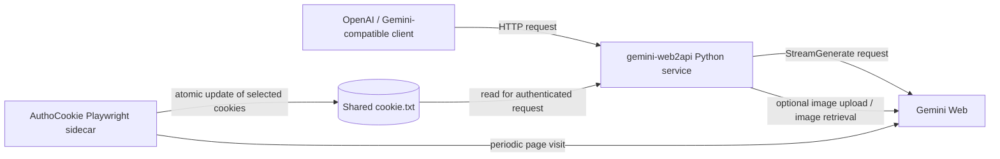

# Gemini Web Bridge and Cookie Keeper Architecture

## 1. Scope and executive summary

This document describes the behavior and relationship of two repositories:

- **gemini-web2api**: a Python service converting a subset of Gemini Web functionality into multiple API formats. It accepts HTTP requests, translates their inputs into Gemini's internal web request payload, calls Gemini Web's `StreamGenerate` endpoint, parses its response, and projects the result into OpenAI Chat Completions, OpenAI Responses, or Google Gemini-compatible responses.
- **AuthoCookie**: an independent Node.js/Playwright background service. Given an already-authenticated Gemini cookie string, it periodically loads that string into a headless browser, visits `https://gemini.google.com/app`, and atomically updates only three selected authentication cookies when Google rotates them.

The data relationship is simple: AuthoCookie may maintain a host-mounted `cookie.txt`; gemini-web2api may be configured with `cookie_file` pointing at that same file. gemini-web2api reads the cookie during generation and does not require the keeper. The keeper does not call the bridge API and does not expose a listening network service.



This is a reverse-engineered integration with undocumented web interfaces, not a stable official developer API. Gemini frontend protocol changes can break the bridge without a source release.

## 2. Repository inventory

### 2.1 gemini-web2api

The repository is a Python 3.8+ application with a single-file compatibility entry point and a package implementation:

| Path | Responsibility |
|---|---|
| `gemini_web2api.py` | Legacy/top-level application implementation and HTTP handler. Contains configuration defaults, model mapping, request processing, and related protocol logic. |
| `gemini_web2api/__main__.py` | Package CLI entry point (`python -m gemini_web2api`), argument parsing and startup. |
| `gemini_web2api/config.py` | Package configuration loading and defaults. |
| `gemini_web2api/server.py` | HTTP server endpoints, authentication and API-format adaptation. |
| `gemini_web2api/gemini.py` | Gemini Web request construction, upstream calls, stream/response parsing. |
| `gemini_web2api/models.py` | Model catalog and compatibility names. |
| `gemini_web2api/conversation.py` | Native conversation continuation state and SQLite-backed persistence. |
| `gemini_web2api/multimodal.py` | Image input parsing, validation/download and upload support. |
| `gemini_web2api/generated_image.py` | Generated-image request handling, result resolution, validation and optional persistence. |
| `gemini_web2api/tools.py` | Function/tool calling conversion and response handling. |
| `config.example.json` | Example runtime configuration. |
| `MULTI_TURN_IMPLEMENTATION_STATUS.md` | Explicit status and known gaps for native conversation state. |
| `gemini-cookie-sync-extension/` | Browser-extension-based cookie sync project files. This is distinct from AuthoCookie's standalone keeper. |
| `tests/` | Project automated tests. |

The README advertises `python -m gemini_web2api`; use the package entry point for normal operation. It also notes direct script invocation in some examples. The package and legacy implementation coexist in the repository; consult current source when modifying one because this documentation does not assert that every behavior is mirrored exactly across both entry points.

### 2.2 AuthoCookie

| Path | Responsibility |
|---|---|
| `keeper.mjs` | Long-running Playwright refresh loop, context/browser lifecycle, Gemini navigation, merging rotated values, signal shutdown. |
| `cookie-utils.mjs` | Cookie-string parsing, selected-name merge, serialization, atomic file replacement. |
| `compose.yaml` | Container configuration, session directory mount and runtime environment. |
| `Dockerfile` | Node/Playwright container build. |
| `test/` | Cookie and keeper test suite, run through `npm test`. |
| `.gitignore` | Ignores local session and credential files. |

AuthoCookie has no login flow and does not collect a Google password. The operator must supply the initial authenticated cookie string out of band.

## 3. System boundaries and trust model

### 3.1 Request-serving boundary

`gemini-web2api` is an HTTP server. Its example defaults bind to `0.0.0.0:8081`; this makes the service reachable on all container interfaces unless firewall/network policy restricts it. API-key enforcement is configurable. With an empty `api_keys` list, the README states authentication is disabled. This is suitable only for a deliberately trusted local network; place authentication and access controls in front of the service when exposing it beyond localhost or a private network.

The bridge sends prompt and conversation data to Google Gemini Web. Requests using image URLs may also cause the bridge to fetch the supplied remote image. The implementation documents restrictions for remote image retrieval (HTTPS/public address checks, redirect bounds, response/type checks); treat user-supplied remote URLs as a network/security boundary and use the implemented policy rather than adding unrestricted fetching.

### 3.2 Credential boundary

Gemini cookies grant access to the authenticated Google session. The bridge can read them from a configured `cookie_file`; the README also documents raw cookie-string and JSON forms. AuthoCookie reads and replaces the configured file. The container mounts the **directory**, not only the file, because atomic rename replaces the file inode.

Recommended file and directory modes are `0600` and `0700`, respectively. The keeper writes the replacement file with mode `0600`; do not assume the API bridge applies equivalent permission controls to a host-provided cookie file. Never put real credentials in source, Compose YAML, shell history, issue reports, or logs.

### 3.3 Upstream protocol boundary

The bridge uses Gemini Web's undocumented `StreamGenerate` RPC and frontend-derived payload slots. Authentication, model naming, request fields and behavior may change at Google's discretion. Error handling and retries improve transient reliability but do not make the protocol stable or guarantee account access.

## 4. gemini-web2api request architecture

### 4.1 High-level request flow

1. A client calls an exposed HTTP endpoint, optionally using Bearer API-key authentication or `x-api-key` as documented.
2. The server parses the requested API shape and converts messages, tools, model/reasoning preferences, image parts, and supported metadata into internal request data.
3. When enabled, conversation resolution selects or creates a native Gemini conversation state; otherwise, messages are flattened into a prompt for a stateless turn.
4. For image input, image parts are validated and uploaded to Gemini's file/image facility; resulting references are incorporated into the generation request. Some image paths require `curl_cffi`.
5. The Gemini module constructs the nested payload and posts to the Gemini Web `StreamGenerate` URL. The request includes a frontend build identifier (`gemini_bl`), locale, request ID and optionally XSRF form field, account path/header, cookies and SAPISID authorization hash.
6. The bridge parses Gemini's framed response, extracts generated text/tool/image results and any continuation metadata.
7. The selected endpoint adapter returns an OpenAI- or Google-shaped response. Streaming routes expose Server-Sent Events where supported; stateful requests have documented buffering limitations.

### 4.2 Gemini request payload and model selection

The source documents frontend payload field `[79]` as the model category. The implementation constructs an array-like payload with fixed index slots, including prompt/files, language, reasoning/think setting, persistence flags, request UUID and model category. This is coupled to Google's client protocol and must be maintained against upstream changes.

The README's model examples include:

| Public model ID | Documented behavior |
|---|---|
| `gemini-3.5-flash-lite` | Flash-Lite compatibility route. |
| `gemini-3.6-flash` | Main Flash compatibility model name; README notes the UI label may lag the underlying model identity. |
| `gemini-3.1-pro` | Pro UI route; a Gemini Advanced subscription cookie is needed for actual Pro routing. Without it, documented behavior falls back to Flash. |

The source also retains legacy/alias IDs (e.g., `gemini-3.5-flash`, thinking, auto, and lite aliases). The model list advertised by `/v1/models` is not necessarily the full alias set accepted internally. Consult `gemini_web2api/models.py` and current README for the exact snapshot behavior before client pinning.

Reasoning controls documented by the README:

- `reasoning.effort` values `none` and `low` select normal reasoning; `medium` and `high` select extended thinking.
- `reasoning.think` can set a raw Gemini think value in payload slot 17.
- A legacy `@think=N` suffix is supported and takes precedence over `reasoning.think`.
- Model-specific defaults still apply; values represent the reverse-engineered Gemini Web controls and are not a public API guarantee.

### 4.3 HTTP/API surface

The README documents these endpoint families:

#### OpenAI-compatible endpoints

- `GET /v1/models`: model list.
- `POST /v1/chat/completions`: Chat Completions request and response, including SSE mode where requested. Supports function/tool calling and documented multimodal image input. The README describes generated-image intent routing from the latest user turn for explicit image-generation requests.
- `POST /v1/responses`: OpenAI Responses-compatible API, including `previous_response_id` conversation continuation. Supports the documented image-generation tool path.
- `POST /v1/images/generations`: one generated image (`n: 1`), OpenAI-shaped result. The `model` field is accepted for compatibility; the Gemini image route is selected independently of the text model catalog. `response_format` defaults to `b64_json`; `url` mode can return a validated Google-hosted URL. `stream`, `size`, `quality`, and `style` are intentionally unsupported.

API keys are optional. If configured, the documented accepted forms are `Authorization: Bearer <key>` and `x-api-key: <key>`. Do not use public unauthenticated exposure.

#### Google-compatible endpoints

The README documents:

- `GET /v1beta/models`
- `POST /v1beta/models/{model}:generateContent`
- `POST /v1beta/models/{model}:streamGenerateContent`

These allow Gemini CLI-compatible access. According to the multi-turn implementation status, these `/v1beta` generation endpoints remain stateless and do not accept/return conversation IDs, even while OpenAI Chat Completions and Responses have state support.

The endpoint list above is README-level contract. Inspect `gemini_web2api/server.py` for exact validation, HTTP errors, fields and stream event details for a pinned revision.

### 4.4 Streaming behavior

Text streaming is supported via SSE for appropriate stateless generation requests. The multi-turn implementation status explicitly says stateful requests currently buffer a complete `generate_turn()` result before emitting downstream; native continuation metadata is not yet captured incrementally from `generate_stream()`. Therefore, do not assume low-latency token streaming when conversation state is enabled. Client disconnects and pending/completed/aborted turn lifecycle are also listed as incomplete in that status document.

Image-input streaming is documented as returning one complete result rather than incremental text. Verify client expectations for stream mode and multimodal requests.

### 4.5 Tool calling

The bridge supports OpenAI-style function tools. The tool adapter translates function definitions and model output between OpenAI tool-call structure and Gemini's representation. The README shows a standard function tool with a name, description and JSON schema. This does not itself execute arbitrary functions: clients/agents generally receive the proposed call and execute it in their own tool runtime, then send the tool result in a subsequent request. Do not assume every OpenAI tool option or parallel-call behavior is supported unless confirmed in the current adapter.

### 4.6 Image input

Documented supported forms include public HTTPS image URLs and base64 data URLs in OpenAI-style message content. Remote image inputs have a 10 MiB maximum, a three-redirect maximum, and protections against private/loopback/link-local destinations. The README says remote fetching uses a direct DNS-pinned connection rather than the configured proxy. Bytes and detected MIME type are validated before upload. `curl_cffi` is required for image input/output routes; cookie configuration may be necessary when anonymous access does not work.

### 4.7 Image output and persistence

Image generation uses an undocumented Gemini Web GUI payload and image RPC flow. For base64 responses, the bridge retrieves images from permitted `googleusercontent.com` HTTPS URLs with Chrome impersonation, bounded redirects/bytes and content-type/format agreement. Hard caps are 10 MiB and three redirects; config values can lower but not raise these caps. When the full-size RPC image is unavailable, the README describes fallback to a validated preview.

Gemini-hosted generated image URLs are temporary. Optional persistent image storage requires configuring **both**:

- `generated_image_store_dir`: local private directory for image bytes.
- `generated_image_base_url`: externally reachable base URL used in returned links.

With both set, the service downloads and validates the image, writes it atomically with restrictive permissions, then serves it at `GET /generated-images/<token>.<ext>` using an unguessable 256-bit filename. The route is intentionally unauthenticated so browser image requests can retrieve it; possession of the unguessable URL is the access control. Route only `/generated-images/` through a reverse proxy and disable directory listings. A partial configuration (only one option) is invalid. Persistent storage has POSIX descriptor-relative/no-follow requirements and fails closed on unsupported platforms.

## 5. Native multi-turn conversation state

### 5.1 Purpose and interface

With `conversation_state_enabled` enabled, the service can continue Gemini Web conversations using Gemini-native continuation metadata rather than resending the full transcript every turn. The implementation status lists continuation values such as `cid`, `rid`, `rcid`, and a context token; continuation payload data is placed in Gemini payload slot `2`.

Supported OpenAI-facing mechanisms documented by the README/status:

- Responses API: standard `previous_response_id`.
- Chat Completions: `metadata.conversation_id`, `metadata.chat_id`, and `X-Gemini-Conversation-ID`.
- Force a fresh conversation with `metadata.new_conversation: true` or `X-Gemini-New-Chat: true`.
- Exact message-history-prefix reconciliation in a trusted client namespace.
- Successful stateful responses may include `conversation_id` and `X-Gemini-Conversation-ID`.

Requests without a safe namespace can fall back to a new conversation, preserving stateless-client compatibility. Do not use source IP or fuzzy semantic matching as a conversation identity mechanism; the README explicitly says neither is used.

### 5.2 Storage, retention and deployment

Conversation records are stored in SQLite at `conversation_store_path` (example `/data/conversations.db`). Configure `conversation_ttl_sec`; the example uses seven days (`604800` seconds). The config example also includes a maximum conversation count, a max turns per conversation and an account namespace; consult the status document because the configured per-conversation turn cap was listed as not yet enforced in the inspected revision.

Mount the parent directory (`/data`) on persistent storage if state must survive restarts. State is local to the bridge database; it is not shared among independently deployed bridge replicas unless an external shared-storage architecture is explicitly supplied (none is documented here).

### 5.3 Known gaps; do not infer completeness

The inspected `MULTI_TURN_IMPLEMENTATION_STATUS.md` explicitly records:

- Stateful generation buffers the full answer; incremental continuation capture is not implemented.
- `/v1beta` Google-compatible endpoints do not expose conversation IDs or stateful continuation.
- Image-generation handlers parse some continuation metadata but do not persist/resume it.
- System/tool fingerprints exist in schema but are not populated/checked, so context changes may not force a new conversation.
- Account identity is based on configured conversation account ID and `auth_user`; all cookie/session changes are not automatically detected.
- Write locks are process-local; stale-branch safeguards exist but full serialization is not implemented for every explicit conversation-ID flow.
- `conversation_max_turns_per_conversation` is not yet enforced.
- Expired `previous_response_id` yields an explicit state error; general recovery and idempotency (`Idempotency-Key`) are incomplete.
- No conversation list/retrieve/delete/expire/branch-inspection API is implemented.
- Open WebUI/Bifrost stable chat-ID forwarding and live acceptance testing remain unverified in that status snapshot.

Treat these as visible behavior constraints, not as proposed guarantees.

## 6. AuthoCookie lifecycle and integration

### 6.1 Refresh cycle

AuthoCookie runs one long-lived headless Chromium browser. At startup and on each interval it:

1. Reads `COOKIE_FILE` (default `/session/cookie.txt`).
2. Starts or reuses Chromium, then creates/recreates an isolated browser context if the browser/context/page is missing or the cookie file content differs from what was loaded.
3. Parses `name=value` pairs and installs them into a `.google.com` secure cookie jar. It refuses to start a browser context if `__Secure-1PSID` is missing.
4. Navigates to `https://gemini.google.com/app`, waits for `domcontentloaded`, then waits `PAGE_SETTLE_MS` to allow session activity/cookie refresh.
5. Reads the live cookie jar and selectively merges only the rotatable cookie family into the original cookie string.
6. If values changed, writes a same-directory temporary file, sets mode `0600`, and renames it atomically over the cookie file. Otherwise logs that no rotation was observed.
7. Sleeps for the configured refresh interval, logging and continuing after an individual refresh error.

The keeper handles SIGTERM and SIGINT by closing the browser context and browser. It exposes no network port.

### 6.2 Exactly which cookie fields are updated

`cookie-utils.mjs` limits replacements/additions to:

- `__Secure-1PSID`
- `__Secure-1PSIDTS`
- `__Secure-1PSIDCC`

All original nonempty cookie pairs are retained in their original order. When a matching browser cookie has a new nonempty value, that value replaces the original. A rotatable cookie absent in the original string may be appended if the browser produced it. Other browser cookies are ignored. Cookie attributes such as `domain`, `path`, `expires`, `secure`, and `samesite` are excluded from cookie-string parsing.

The implementation does **not** refresh SAPISID or all cookies in the header; the bridge's documented SAPISID handling is separate. AuthoCookie's scope is selective routine Gemini authentication-cookie rotation only.

### 6.3 Bridge integration

Mount the same host directory in both containers. AuthoCookie needs write access; the bridge should normally use a read-only mount:

```yaml
services:
  authocookie:
    # Use the repository Compose file or equivalent settings.
    volumes:
      - ./session:/session
  gemini-web2api:
    volumes:
      - ./session:/session:ro
      - ./config.json:/app/config.json:ro
```

Configure gemini-web2api with `"cookie_file": "/session/cookie.txt"`. The bridge should read the file for each new upstream request/session rather than cache a stale cookie indefinitely; if a deployment caches credential state, add a reliable reload/watch behavior in that consumer. The README recommends mounting the directory into the keeper because atomic replacement of a single-file bind mount can leave another container attached to the old inode.

AuthoCookie does not provide the rest of the bridge configuration (API key, `auth_user`, XSRF token, proxy, database path). Configure those independently. The cookie file alone does not prove Gemini Advanced entitlement; real Pro routing requires the paid subscription account described in the bridge README.

## 7. Configuration reference

The following keys are present in `gemini-web2api/config.example.json` at the inspected revision. Values shown below are the example values; confirm code defaults and semantics in the current source before deployment.

| Key | Example | Function / operational notes |
|---|---:|---|
| `port` | `8081` | HTTP listener port. |
| `host` | `0.0.0.0` | Listener address; all interfaces by example. Protect it with network policy/auth. |
| `retry_attempts` | `3` | Upstream retry count. |
| `retry_delay_sec` | `2` | Delay used by retry flow. |
| `request_timeout_sec` | `180` | Upstream request timeout. |
| `gemini_bl` | Frontend build string | Gemini Web frontend build identifier included in RPC URL; can become stale. Source includes a fetch/update attempt on certain upstream failures. |
| `auth_user` | `null` | Optional account index for URLs of form `/u/<index>/`; non-null also sets account header. |
| `xsrf_token` | `null` | Optional Gemini page XSRF token sent as form field `at`; refresh if authenticated requests report XSRF errors. |
| `default_model` | `gemini-3.6-flash` | Default model ID. |
| `api_keys` | `[...]` | `/v1` access keys; empty list disables auth per README. Keep nonempty for shared deployments. |
| `cookie_file` | `null` | Optional path to cookie string or documented JSON cookie object. |
| `proxy` | `null` | Optional upstream proxy. README also documents CLI and proxy environment variable usage. |
| `log_requests` | `true` | Request logging switch. Do not log credentials or sensitive prompts. |
| `temporary_chats` | `false` | Controls Gemini Web temporary-chat payload flags. |
| `conversation_state_enabled` | `true` | Native state toggle in example. |
| `conversation_store_path` | `/data/conversations.db` | SQLite persistence path. Mount its parent for durability. |
| `conversation_ttl_sec` | `604800` | Conversation retention duration. |
| `conversation_max_conversations` | `10000` | Configured conversation ceiling/cleanup value; inspect current enforcement. |
| `conversation_max_turns_per_conversation` | `200` | Present in example; status says this limit was not yet enforced in the inspected snapshot. |
| `conversation_account_id` | `default` | Namespace/fingerprint input for account-level conversation isolation. |
| `generated_image_max_bytes` | `10485760` | Image download cap; can lower the fixed ceiling, not exceed 10 MiB. |
| `generated_image_max_redirects` | `3` | Redirect cap; cannot exceed hard maximum of three. |
| `generated_image_store_dir` | `null` | Optional persistent generated-image directory; requires base URL too. |
| `generated_image_base_url` | `null` | Optional public URL base for persisted image results; requires store directory too. |

AuthoCookie environment variables:

| Variable | Default | Effect |
|---|---|---|
| `COOKIE_FILE` | `/session/cookie.txt` | Cookie string path read and atomically replaced. |
| `REFRESH_INTERVAL_MS` | `300000` | Refresh interval; clamped to a minimum of `60000` ms. |
| `PAGE_SETTLE_MS` | `5000` | Post-navigation delay before reading cookies; a nonnegative value. |
| `BROWSER_USER_AGENT` | Chrome-like Linux UA | Optional browser user-agent override. |

## 8. Installation and deployment

### 8.1 Bridge: local Python

The repository README specifies Python 3.8+, `pip install -r requirements.txt`, and `python -m gemini_web2api`. `httpx` is used for text streaming; `curl_cffi` is needed for documented multimodal/generated image behavior. Install the repository's declared requirements rather than inferring that the minimal text path has identical feature dependencies.

The service listens on port 8081 by default and the OpenAI-compatible base URL is `http://localhost:8081/v1`. Gemini CLI uses `GOOGLE_GEMINI_BASE_URL=http://localhost:8081` and an API key setting as shown in upstream README.

### 8.2 Bridge: Docker

The upstream README's basic container flow:

```bash
cp config.example.json config.json
docker build -t gemini-web2api .
docker run -d --name gemini-web2api \
  -p 8081:8081 \
  -v ./config.json:/app/config.json \
  gemini-web2api
```

For credentials, mount the directory/file path and set `cookie_file` to the in-container path. For stateful conversations, mount persistent storage at the parent of `conversation_store_path`, e.g. `./conversation-data:/data`. For persistent generated images, mount the configured image directory.

The README notes that Gemini may reject requests from some Docker bridge NAT address ranges, producing empty `content: null` responses; it recommends host networking as a deployment-specific workaround. Host networking changes isolation/exposure characteristics, so apply firewall controls if using it.

### 8.3 AuthoCookie: Docker Compose

Create a private `session` directory and place an existing cookie string in `session/cookie.txt`:

```bash
mkdir -p session
chmod 700 session
printf '%s\n' 'YOUR_COOKIE_HEADER_VALUE' > session/cookie.txt
chmod 600 session/cookie.txt
docker compose up -d --build
docker compose logs -f authocookie
```

The upstream repo publishes `ghcr.io/sortedcord/authocookie:latest` for `linux/amd64`; Compose can use that image instead of building locally. The provided Compose configuration sets `init: true`, `shm_size: 512mb`, restart policy, refresh timing, and mounts `./session:/session`. Do not paste a real credential into Compose or a shell command on a shared machine: the quick-start command is illustrative; use a safer protected file-injection workflow where shell history/process capture is a concern.

### 8.4 Updating a logged-in session

If Google requires a new login, replace the cookie file with a newly exported authenticated value. The AuthoCookie README recommends atomic replacement from a staged file and mode `0600`. The keeper observes changed content on its next cycle and creates a fresh isolated browser context; restart triggers an immediate refresh attempt. A fresh cookie export must be obtained from an authorized session. AuthoCookie does not perform login/MFA/CAPTCHA.

## 9. Authentication and cookie setup notes

The bridge README documents raw Cookie header content or JSON of the form `{"cookie":"...","sapisid":"..."}`. When a raw cookie string is supplied, `SAPISID` is parsed for its authorization hash. The server computes `SAPISIDHASH <timestamp>_<sha1>` over timestamp, SAPISID, and `https://gemini.google.com` as shown in the top-level implementation. It sends the cookie header and hash when present.

For account path selection, if the signed-in Gemini URL includes `/u/1/`, use `auth_user: "1"`. Authenticated requests may require the page token `SNlM0e` as `xsrf_token`, sent in form parameter `at`. An XSRF error indicates the token/account index may need refreshing. Do not confuse this page token with the cookie string or API key.

The README says anonymous access works for all models, but Pro model requests fall back to Flash unless a Gemini Advanced paid-account cookie is configured. A free account cookie can authenticate without granting paid model routing.

## 10. Security and operational recommendations

1. **Treat cookies as credentials.** Restrict session directory to its owner (`0700`) and cookie file to owner read/write (`0600`). Keep backups encrypted and access controlled.
2. **Keep the bridge private.** Configure nonempty API keys; bind to a private interface or place a trusted authenticated reverse proxy/firewall in front. Avoid public unauthenticated access.
3. **Separate container privileges.** Keeper needs write access to the shared session directory; the bridge only needs read access. Use a read-only bridge mount where practical.
4. **Do not expose browser control.** AuthoCookie does not need published ports. Do not add Chromium remote-debugging exposure.
5. **Limit logs and dumps.** Ensure request logs, container logs, crash reports, and support bundles do not contain cookie headers, XSRF tokens, or sensitive prompts.
6. **Protect generated-image access.** The persistent image route is unauthenticated by design; its high-entropy URL token is a bearer link. Avoid access logs that leak tokens, and expose only its specific path.
7. **Use persistent state mounts carefully.** SQLite and generated-image directories contain user-related data; constrain permissions, backups, retention and volume access.
8. **Expect operational session failure.** A refreshed cookie is not equivalent to a valid session. Full logout, revocation, password reset, MFA, CAPTCHA, or account security challenge requires manual re-authentication and a new cookie export.
9. **Monitor upstream compatibility.** Investigate errors after Gemini frontend rollouts; current `gemini_bl`, payload fields, response framing, model catalog, and image protocol can all drift.
10. **Check legal and account rules.** Both projects automate access to a consumer web interface; operators are responsible for complying with applicable Google terms, account policies and local requirements.

## 11. Troubleshooting guide

| Symptom | Likely checks |
|---|---|
| API cannot connect to Gemini / request timeout | Verify outbound network, region access, proxy configuration, DNS/TLS, and `request_timeout_sec`. |
| Repeated HTTP 405 / request rejected | `gemini_bl` may be stale; inspect refresh log and upstream HTML availability. Confirm current frontend protocol. |
| Authenticated request has XSRF error / HTTP 400 | Refresh Gemini Web; update `xsrf_token` (`SNlM0e`) and ensure `auth_user` matches `/u/<index>/`. |
| Pro request returns Flash quality/model | Verify account has Gemini Advanced entitlement and cookie belongs to that account; a cookie alone does not grant subscription access. |
| Empty `content: null` only in Docker | Check upstream behavior from container egress/NAT; README notes host-network mode may help, with networking security tradeoffs. |
| Image upload or generation fails | Confirm `curl_cffi` installed; test with supported image MIME and bounded public HTTPS URL; configure authenticated cookies if required. Check Gemini image protocol drift. |
| Generated image link expires after a while | Configure both persistent image options and mount persistent storage; otherwise Google-hosted URL is temporary. |
| Stateful follow-up starts a new chat | Check state enabled/database persistence, same client namespace, returned conversation ID/previous response ID, TTL, and exact prefix. Google-compatible endpoints are stateless. |
| Stateful stream has high latency | Expected limitation in inspected status: stateful generation buffers complete `generate_turn()` before streaming output. |
| AuthoCookie says missing `__Secure-1PSID` | Cookie file is empty/malformed or does not include required session cookie; export a fresh authenticated cookie string. |
| AuthoCookie logs no cookie rotation | This can be normal; it writes only when selected cookie values change. It does not refresh unrelated cookies. |
| AuthoCookie refresh fails persistently | Check session validity, container DNS/TLS/network, Chromium startup, shared volume permissions, and whether Google requires manual re-authentication. |
| API reads old cookie after keeper update | Mount the whole directory (not a single-file bind mount); ensure consumer reloads file on each request or watches changes. |

## 12. Verification and maintenance

The upstream README lists `npm test` and `docker build` for AuthoCookie development. The bridge repository includes a `tests/` directory; use the project’s current test instructions/scripts and exercise API paths against a controlled environment. This documentation author did not run either project or make live Gemini requests; it describes source/README behavior only.

Before upgrading either repository:

1. Pin and inspect the new source revision.
2. Compare README contracts, config example and implementation status.
3. Check API shape and streaming behavior with representative text, tool, image and continuation scenarios.
4. For AuthoCookie, test parsing, preserving unrelated cookies, updating each rotatable cookie, adding a newly observed rotatable cookie, atomic replacement, permissions, and restart/reload behavior without using real credentials in test fixtures.
5. Confirm the bridge reloads the cookie file and has read-only access to it in the deployment configuration.
6. Revisit this documentation's snapshot references, config table and known limitations.

## 13. Source references

All paths are repository-relative; links are pinned to the inspected snapshots.

### gemini-web2api

- [README](https://github.com/sortedcord/gemini-web2api/blob/b35758c900e57df8f415be04cc5aaec49b80cf02/README.md)
- [Example config](https://github.com/sortedcord/gemini-web2api/blob/b35758c900e57df8f415be04cc5aaec49b80cf02/config.example.json)
- [Top-level implementation](https://github.com/sortedcord/gemini-web2api/blob/b35758c900e57df8f415be04cc5aaec49b80cf02/gemini_web2api.py)
- [Package server](https://github.com/sortedcord/gemini-web2api/blob/b35758c900e57df8f415be04cc5aaec49b80cf02/gemini_web2api/server.py)
- [Conversation implementation](https://github.com/sortedcord/gemini-web2api/blob/b35758c900e57df8f415be04cc5aaec49b80cf02/gemini_web2api/conversation.py)
- [Multi-turn implementation status](https://github.com/sortedcord/gemini-web2api/blob/b35758c900e57df8f415be04cc5aaec49b80cf02/MULTI_TURN_IMPLEMENTATION_STATUS.md)

### AuthoCookie

- [README](https://github.com/sortedcord/AuthoCookie/blob/c2985204bdee8aed169b63305a6323030e6c3136/README.md)
- [Keeper loop](https://github.com/sortedcord/AuthoCookie/blob/c2985204bdee8aed169b63305a6323030e6c3136/keeper.mjs)
- [Cookie utilities](https://github.com/sortedcord/AuthoCookie/blob/c2985204bdee8aed169b63305a6323030e6c3136/cookie-utils.mjs)
- [Compose configuration](https://github.com/sortedcord/AuthoCookie/blob/c2985204bdee8aed169b63305a6323030e6c3136/compose.yaml)
